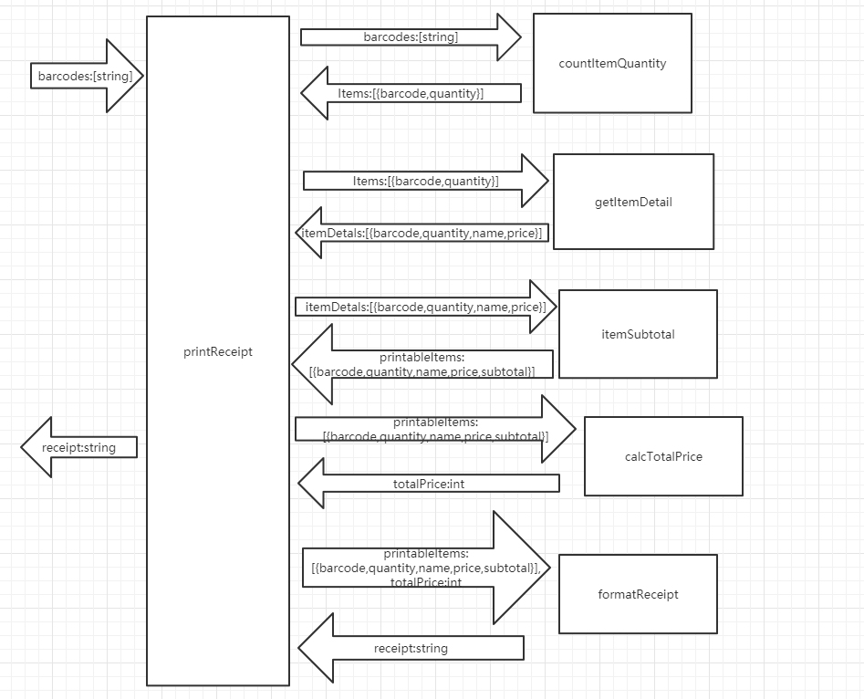

#### tasking

1.统计每个商品的数量

|      | countItemQuantity    |
| ---- | -------------------- |
| P    | 5min                 |
| D    | 10min                |
| C    | 有个变量写错了，以为是逻辑错误，找了好久 |
| A    | 写代码的时候要认真细心          |

2.根据商品barcodes 获取商品详细数据

|      | getItemDetail        |
| ---- | -------------------- |
| P    | 5min                 |
| D    | 3min                 |
| C    | 这部分代码逻辑比较简单，所以很快就写完了 |
| A    | 以后遇到相似的业务代码要以更高的效率完成 |

3.计算商品总价格

|      | itemSubtotal  |
| ---- | ------------- |
| P    | 3min          |
| D    | 3min          |
| C    | 完成的比较好，和预期的一样 |
| A    | 继续保持          |

4.计算总价格

|      | calcTotalPrice |
| ---- | -------------- |
| P    | 3min           |
| D    | 1min           |
| C    | 业务逻辑比较简单       |
| A    | 继续保持           |

5.格式化输出

|      | formatReceipt            |
| ---- | ------------------------ |
| P    | 3min                     |
| D    | 2min                     |
| C    | 字符串拼接效率有点低，导致在这上面花费的时间较多 |
| A    | 寻找是否有跟高效的方法              |

6.打印票据

|      | printReceipt               |
| ---- | -------------------------- |
| P    | 3min                       |
| D    | 3min                       |
| C    | 根据上下文图能够很快速的写出该方法，并输出正确的结果 |
| A    | 寻找是否有更好的解决方案               |

#### 上下文图

